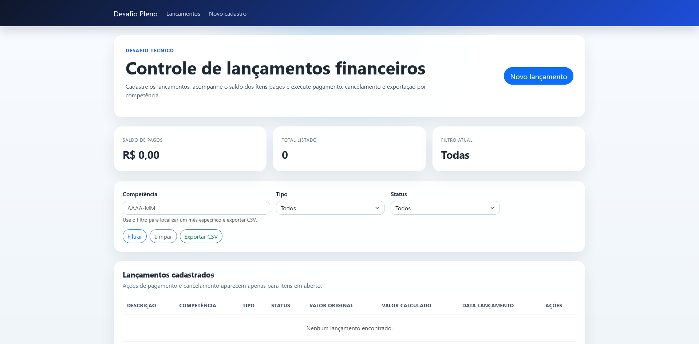
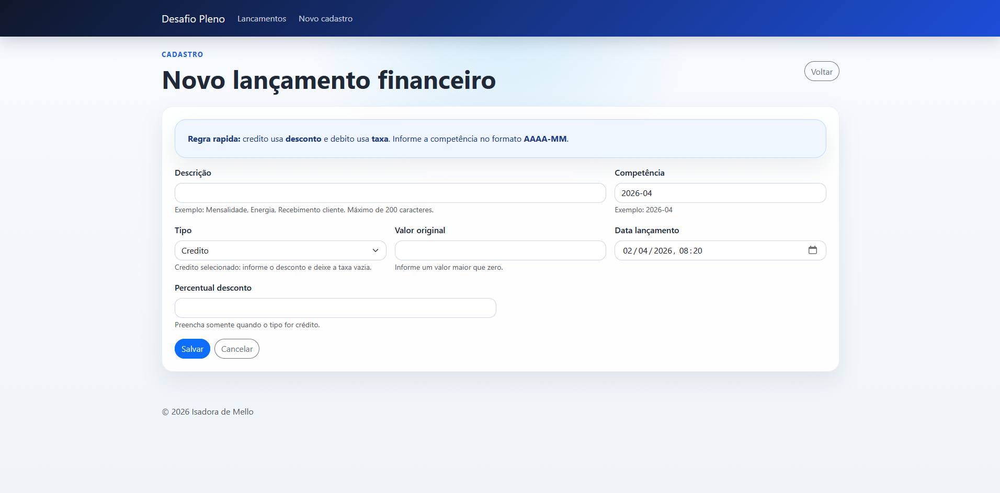

# Desafio Técnico - Controle Financeiro

Aplicação web para controle de lançamentos financeiros, desenvolvida como parte de um desafio técnico.

## Tecnologias utilizadas

- ASP.NET Core (Razor Pages)
- C#
- SQL Server
- ADO.NET puro

## Visão geral

O projeto foi organizado em camadas para separar apresentação, regras de negócio e acesso a dados.

## Observação sobre a arquitetura

O projeto foi desenvolvido utilizando ASP.NET Core com Razor Pages.

A proposta original mencionava ASP.NET Web Forms (baseado em .NET Framework). No entanto, como as versões mais recentes do .NET não possuem suporte a essa tecnologia, foi utilizada uma abordagem moderna equivalente.

Razor Pages foi escolhido por manter uma estrutura simples e próxima ao modelo baseado em páginas, sem utilização de MVC, atendendo assim ao objetivo do desafio.

## Estrutura da solucao

- `WebApp/frontend/frontend`: camada de apresentacao
- `WebApp/CodeBehind`: implementacao da camada `Business`
- `Data`: camada de acesso a dados

## Documentacao por camada

- [Business/README.md](C:\xampp\htdocs\desafioPleno\Business\README.md): regras de negocio, validacoes e comunicacao entre camadas
- [Data/README.md](C:\xampp\htdocs\desafioPleno\Data\README.md): classes de acesso a dados e script SQL
- [WebApp/frontend/frontend/README.md](C:\xampp\htdocs\desafioPleno\WebApp\frontend\frontend\README.md): camada de apresentacao e paginas principais

## Pré-requisitos

- `.NET 8 ou superior`
- `SQL Server` ou `LocalDB`
- `Visual Studio 2026` ou terminal com `dotnet`

## Como executar

### 1. Criar o banco de dados

Execute o script [CreateDatabase.sql](C:\xampp\htdocs\desafioPleno\Data\Scripts\CreateDatabase.sql) no SQL Server.

### 2. Ajustar a conexao

Abra [appsettings.json](C:\xampp\htdocs\desafioPleno\WebApp\frontend\frontend\appsettings.json) e confirme a `connection string`.

Exemplo:

```json
"DefaultConnection": "Server=(localdb)\\MSSQLLocalDB;Database=DesafioPlenoDb;Trusted_Connection=True;TrustServerCertificate=True;"
```

### 3. Restaurar os pacotes

Na raiz do projeto, execute:

```powershell
dotnet restore WebApp\frontend\frontend\frontend.csproj
```

### 4. Executar a aplicacao

Na raiz do projeto, execute:

```powershell
dotnet run --project WebApp\frontend\frontend\frontend.csproj
```

### 5. Abrir no navegador

Acesse:

- [http://localhost:5000](http://localhost:5000)

## Onde encontrar as demais informacoes

- detalhes de regras de negocio: [Business/README.md](C:\xampp\htdocs\desafioPleno\Business\README.md)
- detalhes de persistencia e banco: [Data/README.md](C:\xampp\htdocs\desafioPleno\Data\README.md)
- checklist geral do projeto: [PROJECT_CHECKLIST.md](C:\xampp\htdocs\desafioPleno\PROJECT_CHECKLIST.md)

## Interface



